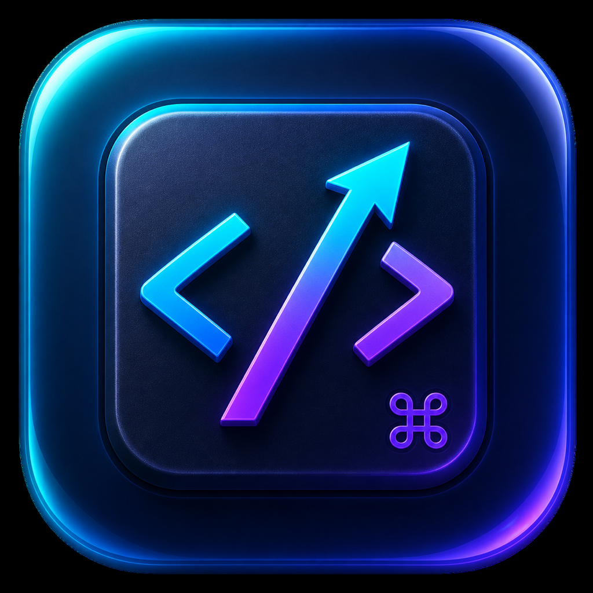

# Devigator

Devigator is a universal macOS shortcut overlay for code navigation. Hold `⌘` by itself for about 1 second and it detects the frontmost editor, then shows a focused set of navigation, usage, hierarchy, search, and history shortcuts.

> **Built with AI** — Devigator was created with OpenAI Codex. Its source, shortcut data, and generated distribution artifacts should be reviewed and tested before production use.



The MVP includes profiles for:

- Xcode
- Visual Studio Code
- IntelliJ IDEA
- WebStorm
- PyCharm
- Android Studio
- Eclipse IDE

## Build and run

Requirements: macOS 13 or later and Xcode 15.3 or later.

```sh
swift test
./scripts/build-app.sh
open build/Devigator.app
```

Create local distribution artifacts with:

```sh
./scripts/package-release.sh
```

This produces a drag-to-Applications DMG, a macOS ZIP, and SHA-256 checksums under `dist/`. Local artifacts use ad-hoc signing; public distribution additionally requires Developer ID signing and Apple notarization.

Devigator runs as a menu bar app. Holding Command by itself for about 1 second temporarily shows the HUD, and releasing Command hides it. Pressing another key or modifier cancels the hold gesture so normal shortcuts such as `⌘C` are unaffected. The behavior can be disabled with **⌘ 길게 눌러 표시** in the menu bar; **오버레이 보기** remains available for manual display.

While visible, the HUD stays above normal and full-screen application windows. Switching applications updates the HUD immediately to the newly focused editor without closing it.

The HUD is split into small, nearly transparent shortcut groups placed around the pointer. Groups contain at most four shortcuts and are laid out upper-left, lower-left, upper-right, then lower-right. Continuously following the pointer is the default; **HUD 위치** also provides fixed near-cursor and screen-center modes. All pointer HUD panels are click-through.

## Edit and distribute profiles

Choose **프로필 편집…** from the menu bar item to edit JSON with live validation, duplicate a built-in profile, or import/export a `.devigator.json` file. Built-in and provider profiles are never changed in place; saving one creates a user override.

IDE plugins and vendors can publish profiles into:

```text
~/Library/Application Support/Devigator/Profiles/Providers/<provider-id>/
```

User-owned profiles live under `Profiles/User/` and take precedence. Profile schema 1.2 separates canonical `capabilityID`/`categoryID` values from IDE-specific `commandID` values and supports standardized pointer alternatives such as `⌘ + click`. HUD labels resolve from the built-in English/Korean capability catalog and fall back to the profile text. See [the profile specification](Docs/PROFILE_SPEC.md), [profile JSON Schema](Schemas/devigator-profile.schema.json), and [capability catalog schema](Schemas/devigator-capability-catalog.schema.json).

## Current scope

Version 0.1 reads editor identity from the frontmost macOS application and pointer position from macOS. It does not yet query the caret or semantic editor context, or evaluate profile `when` expressions. Editor plugins can already export the user's resolved keymap using stable `commandID` values; live IPC synchronization is reserved for a later version.
